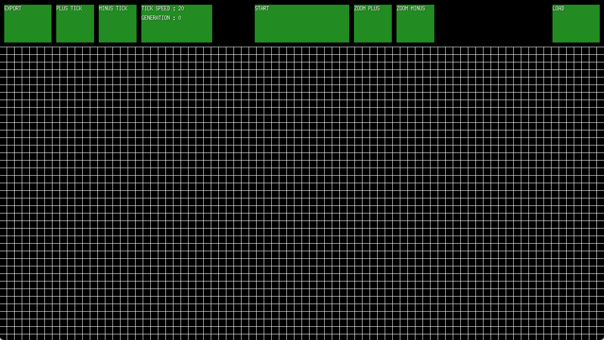

# Game of Life in Golang

This project is an implementation of the classic cellular automaton, Conway's Game of Life, in the Go programming language.

Made by **Simon Bredeche** and **Jérémie Barrière**

## Getting Started

These instructions will get you a copy of the project up and running on your local machine for development and testing purposes.

### Prerequisites

- An IDE that supports Go (like GoLand)

### Installing

1. Clone the repository to your local machine.
2. Navigate to the project directory.

## Usage

### Running the Project

To run the Game of Life once, use the following command in the terminal:

```bash
go run main.go
```

### Building the Project

To build the Game of Life project and create an executable file, use the following command in the terminal:

```bash
go build -o gameoflife main.go
```
You can replace `gameoflife` with any name you want for the executable file.

## Project Structure

The project is structured as follows:

- `main.go`: This is the entry point of the application. It initializes the game grid, sets the window size and title, and starts the game loop.
- `grid.go`: This file contains the logic for the Game of Life. It includes functions for updating the game grid and detecting user input.
- `gui.go`: This file contains functions for updating the GUI and detecting user input.
- `export.go`: This file contains functions for exporting the game grid to a text file.
- `globals.go`: This file contains global constants and variables used throughout the project.
- `go.sum` and `go.mod`: These files are used to handle the project's dependencies.

```
├── README.md
├── export
│   └── export.go
├── game
│   ├── grid.go
│   └── gui.go
├── go.mod
├── go.sum
├── main.go
└── shared
    └── globals.go
```

## Game Preview

Here is a preview of the Game of Life in action:



## Controls

This section provides a detailed explanation of the controls available in the Game of Life application.

- **Export**: This button allows you to export the current state of the game grid as a text file. This can be useful for saving a particular configuration of cells that you want to revisit later.

- **Plus Tick**: This button slows down the speed of the game. Each "tick" represents a single generation in the Game of Life, so increasing the time between ticks will make the game progress more slowly.

- **Minus Tick**: This button speeds up the game. Decreasing the time between ticks will make the game progress more quickly.

- **Tick Speed and Generation**: These are not buttons, but indicators. The "Tick Speed" indicator shows the current speed of the game (i.e., the time between ticks), and the "Generation" indicator shows the current generation number.

- **Start/Stop Button**: This button starts or stops the game. When the game is running, the cells on the grid will update according to the rules of the Game of Life at each tick.

- **Zoom Plus**: This button zooms in on the game grid, making the cells appear larger.

- **Zoom Minus**: This button zooms out from the game grid, making the cells appear smaller.

- **Load**: This button allows you to load a game grid from a text file. This can be useful for loading a previously saved configuration of cells.

The `updateGui` function in the `game/gui.go` file is responsible for handling the actions associated with clicking on the various buttons in the application.
